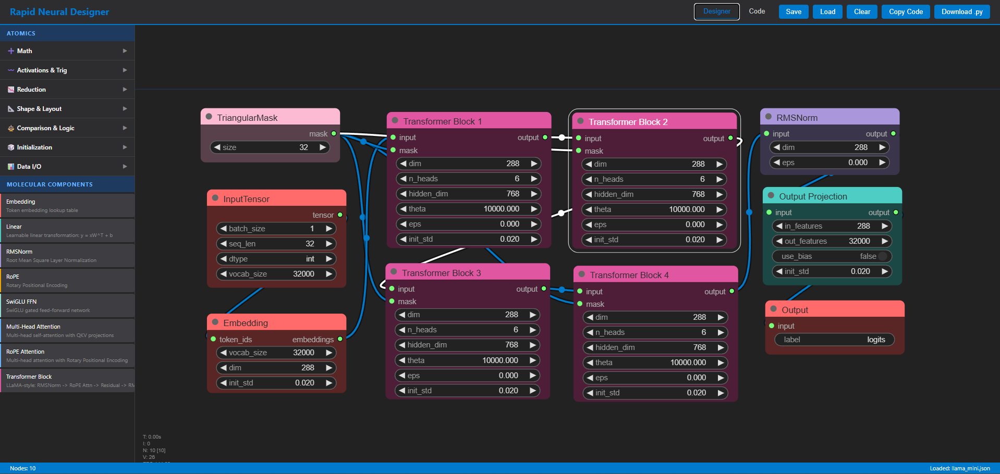

# Rapid Neural Designer (RND)

A node graph editor for designing neural network architectures from composable primitives. Build, modify, and share architectures visually — from raw tensor operations up to complete models like LLaMA.



## Quick Start

1. Open `web_interface/index.html` in any modern browser
2. Wire together primitives or drop in pre-built components
3. Switch to the Code tab to see generated Python
4. Download and run — no dependencies except numpy

**No installation, no server, no build tools required.**

## How It Works

RND uses a three-layer architecture:

**Primitives** — 54 fundamental tensor operations (matmul, add, softmax, reshape, etc.) defined as JSON code templates. These are the periodic table — they can't be broken down further.

**Components** — Compositions of primitives saved as reusable building blocks. RND ships with: Linear, RMSNorm, RoPE, SwiGLU FFN, Multi-Head Attention, RoPE Attention, and Transformer Block.

**Models** — Complete architectures built from components. RND ships with a Mini LLaMA (4-layer, dim=288, 6 heads, 32k vocab) as a reference.

### Condense & Explode

Select multiple nodes and **Condense** them into a single reusable component. Right-click any component and **Explode** it to see and modify its internals. This works recursively — a Transformer Block explodes into RMSNorm + Attention + FFN + Residuals, and each of those can be exploded further down to raw primitives.

### Code Generation

The graph compiler traces wire connections, topologically sorts nodes, and substitutes variables into code templates using handlebars-style (`{{variable}}`) interpolation. The output is a single runnable Python script.

## Adding New Primitives

Primitives are JSON files in `web_interface/atomics/`. Add a new one:

```json
{
  "name": "MyOp",
  "id": "my_op",
  "category": "math",
  "inputs": [{"name": "input", "type": "tensor"}],
  "outputs": [{"name": "result", "type": "tensor"}],
  "code": "{{result}} = my_operation({{input}})",
  "imports": ["import numpy as np"]
}
```

Register it in `atomics/index.json` and it appears in the palette automatically.

## Saving Components

Build a component from primitives in the graph, select the nodes, right-click **Condense**, name it. Right-click the new component and **Save to File**. Drop the JSON into `web_interface/components/` and add it to `components/index.json` to make it permanent.

## Controls

| Action | How |
|--------|-----|
| Add nodes | Click in palette or right-click canvas |
| Connect | Drag from output port to input port |
| Select multiple | Drag box on empty canvas, or shift+click |
| Condense | Select nodes → right-click → Condense |
| Explode | Right-click component → Explode |
| Save component | Right-click component → Save to File |
| Pan | Middle-click drag |
| Zoom | Scroll wheel |

## Running Code

For local execution, start the backend:

```bash
pip install flask flask-cors
cd web_interface
python backend.py
```

Then click **Run Code** in the Code tab.

## File Structure

```
web_interface/
  index.html              # Graph editor (single-file app)
  atomics/                # Primitive definitions (JSON)
    math.json, trig.json, reduction.json, shape.json,
    comparison.json, init.json, data.json
  components/             # Pre-built components (JSON)
    linear.json, rmsnorm.json, rope.json, swiglu_ffn.json,
    multi_head_attention.json, rope_attention.json,
    transformer_block.json, embedding.json
  models/                 # Saved model graphs (JSON)
    llama_mini.json
  backend.py              # Optional Flask execution server
```

## Technical Details

- Built with [LiteGraph.js](https://github.com/jagenjo/litegraph.js) for the node graph
- [Monaco Editor](https://microsoft.github.io/monaco-editor/) for code display
- Pure JavaScript — runs entirely in browser, zero build step
- Generates numpy-based Python code
- JSON format for primitives, components, and saved graphs
