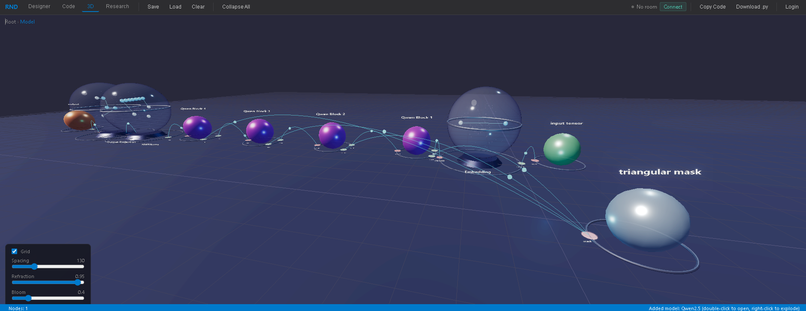

# Rapid Neural Designer (RND)

A visual platform for designing, exploring, and researching neural network architectures. Build models from composable primitives in a node graph, explore them in 3D, run experiments, and manage research — all from the browser.


## Features

### Visual Graph Editor
Wire together primitives or drop in pre-built components to design architectures. Select multiple nodes and **Condense** them into reusable components, or **Explode** any component to see and modify its internals — recursively, all the way down to raw tensor operations.

### 3D Architecture Explorer
Visualize entire architectures as interactive 3D scenes. Components render as glass spheres with nested subcomponents inside, connected by data flow wires. Navigate with breadcrumb trails, double-click to dive into components, right-click to explode them.



### Code Generation
The graph compiler traces connections, topologically sorts nodes, and generates a single runnable Python script via handlebars-style template substitution. Output is numpy-based with no external dependencies.

### Research Platform
A structured research management system built into the backend. Organize work into **Programs > Projects > Threads > Statements/Experiments > Findings**. Every claim traces back to an architecture and experiment. Designed for reproducibility.

- **Threads**: Research questions with resolution criteria
- **Statements**: Testable hypotheses within a thread
- **Experiments**: Link architectures, datasets, and hyperparameters to hypotheses
- **Evidence**: Connect experiment results to statements (supports/contradicts/neutral)
- **Findings**: Resolve threads with reasoning and evidence chains
- **Papers**: Draft papers with sections linked to threads and projects
- **Disclosures**: Citable documents (papers, patents, datasets, code)

### MCP Integration
The platform exposes a [Model Context Protocol](https://modelcontextprotocol.io) endpoint at `/mcp`, enabling Claude (Desktop, Code, or claude.ai) to directly create and manage research entities. 35 tools covering the full research workflow — programs, projects, threads, experiments, papers, and more.

Connect from Claude Desktop:
```json
{
  "mcpServers": {
    "rnd-platform": {
      "url": "http://localhost:5000/mcp"
    }
  }
}
```

### REST API
Full resource-oriented API at `/api/rnd/*` with token-based authentication. Supports all research entities, search, graph queries (children, evidence chains, citations, backlinks, architecture variants), and index management.

### Collaboration
Real-time collaborative editing via SocketIO rooms. Multiple users can work on the same architecture simultaneously with live sync.

## Quick Start

```bash
pip install flask flask-cors flask-socketio
cd web_interface
python backend.py
```

Open `http://localhost:5000` in your browser.

The backend serves the graph editor, 3D viewer, research UI, REST API, and MCP endpoint — all on one port.

## Architecture Library

### Primitives
54 fundamental tensor operations across 7 categories: math, activations, reduction, shape, comparison, initialization, and data I/O. Defined as JSON code templates in `web_interface/atomics/`.

### Components
29 pre-built compositions: Linear, RMSNorm, RoPE, SwiGLU FFN, Multi-Head Attention, GQA Attention, Transformer Block, Conv2d, LSTM, GAT Layer, Mamba Block, MoE Layer, Liquid Cell, Cross Attention, and more. Stored in `web_interface/components/`.

### Models
20 ready-to-load architectures: LLaMA, Qwen, Mixtral, BERT, Mamba, Liquid, LLaDA, ResNet, U-Net, GAN, GAT, VAE, Autoencoder, CNN, RNN, LSTM, Seq2Seq, MLP, DROGA (experimental). Stored in `web_interface/models/`.

## Adding Primitives

Primitives are JSON files in `web_interface/atomics/`. Add a new one:

```json
{
  "name": "MyOp",
  "id": "my_op",
  "category": "math",
  "inputs": [{"name": "input", "type": "tensor"}],
  "outputs": [{"name": "result", "type": "tensor"}],
  "code": "{{result}} = my_operation({{input}})",
  "imports": ["import numpy as np"]
}
```

Register it in `atomics/index.json` and it appears in the palette automatically.

## Controls

| Action | How |
|--------|-----|
| Add nodes | Click in palette or right-click canvas |
| Connect | Drag from output port to input port |
| Select multiple | Drag box on empty canvas, or shift+click |
| Condense | Select nodes > right-click > Condense |
| Explode | Right-click component > Explode |
| Save component | Right-click component > Save to File |
| Pan | Middle-click drag |
| Zoom | Scroll wheel |

## File Structure

```
web_interface/
  index.html              # Graph editor UI
  3d.html                 # 3D architecture explorer
  backend.py              # Unified backend (editor + API + MCP)
  atomics/                # Primitive definitions (JSON)
  components/             # Pre-built components (JSON)
  models/                 # Saved model graphs (JSON)

rnd/
  models.py               # Domain models (programs, threads, experiments, etc.)
  repo.py                 # Git-backed entity persistence
  index.py                # Derived SQLite index for search/graph queries
  auth.py                 # User auth with PBKDF2 + token sessions
  mcp_endpoint.py         # MCP Streamable HTTP endpoint
  server.py               # Standalone API server (alternative to unified backend)
  cli.py                  # CLI interface
```

## Technical Details

- [LiteGraph.js](https://github.com/jagenjo/litegraph.js) for the node graph editor
- [Three.js](https://threejs.org/) for 3D visualization
- [Monaco Editor](https://microsoft.github.io/monaco-editor/) for code display
- Flask + SocketIO backend
- Git-backed persistence for research entities
- SQLite derived index for search and graph queries
- MCP Streamable HTTP for AI tool integration
- Pure JavaScript frontend — zero build step
