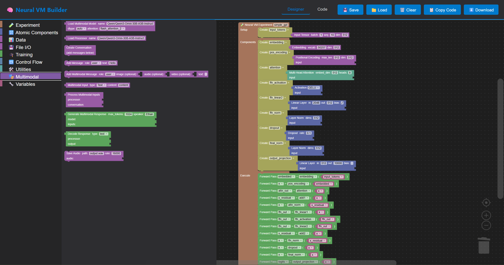

# Rapid Neural Designer (RND)

A Scratch-like visual programming interface for rapidly prototyping neural network experiments with drag-and-drop atomic components.

## Features

- **🎨 Visual Block Programming**: Build neural networks like Scratch - no code required
- **⚡ Real-time Code Generation**: See Python code generated as you build
- **✓ Smart Validation**: Automatic linting for component connections and tensor dimensions
- **💾 Save/Load**: Export and import experiments as XML
- **📥 Export Code**: Download generated Python code to run locally
- **🧪 Experiment-First**: Designed for rapid experimentation and iteration

## Quick Start

1. Open `web_interface/index.html` in any modern browser
2. Drag blocks from the toolbox to build your neural network
3. Download the generated Python code
4. Run it locally - no dependencies except numpy

**No installation, no server, no build tools required.**

## Available Blocks

### 🧪 Experiment Structure
- **Neural VM Experiment**: Main container for your experiment
- **Create Component**: Define and name neural components
- **Forward Pass**: Execute computation through components
- **Print State**: Display captured computational state

### 🔢 Neural Components
- **Linear Layer**: Linear transformation with configurable dimensions and bias
- **Multi-Head Attention**: Attention mechanism with Q/K/V state capture

### 📊 Data & Variables
- **Input Tensor**: Create random input tensors with configurable shapes
- **Variable**: Reference variables from your experiment

## Example: Simple Transformer Layer

1. Drag **"🧪 Neural VM Experiment"** to workspace
2. Add **Input Tensor** (batch=1, seq=10, dim=512)
3. Create **Multi-Head Attention** component (embed_dim=512, heads=8)
4. Create **Linear Layer** component (in=512, out=512)
5. Add **Forward Pass** blocks to execute
6. Click **"⬇️ Download"** for Python code

## Controls

- **💾 Save**: Export workspace as XML
- **📁 Load**: Import saved workspace
- **🗑️ Clear**: Clear entire workspace
- **📋 Copy Code**: Copy Python to clipboard
- **⬇️ Download**: Download Python file

## Generated Code

Generates clean, runnable Python compatible with numpy:
- Proper imports and structure
- Component initialization
- Forward passes with full state capture
- State inspection and logging

## What Makes RND Different?

Most visual neural network builders just create model architectures. **RND captures the full computational state** - all intermediate tensors, attention patterns, Q/K/V projections, and semantic metadata. This enables:

- Deep introspection into what your network is actually doing
- Research into cross-architecture neural computation
- Building hybrid architectures that share semantic state
- Educational tools that show every step of computation

## Future Enhancements

- More atomic components (RNN, Mamba, CNN, GNN)
- Tensor dimension mismatch detection
- Visual state visualization
- Context bus operations (Phase 2)
- Control flow (loops, conditionals)
- Live execution in browser

## Technical Details

- Built with Google Blockly (web version of Scratch)
- Pure JavaScript - runs entirely in browser
- Generates numpy-based Python code
- XML workspace format for save/load

---

**Built for rapid neural network R&D** 🚀
